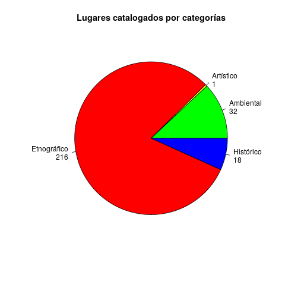

## Índice por categorías

<i class="fa fa-tag"></i> &nbsp;<a href="{{ site.github.url }}/lugares/categorias/index.html#ambiental">Ambiental</a> &nbsp;&nbsp;&nbsp;
<i class="fa fa-tag"></i> &nbsp;<a href="{{ site.github.url }}/lugares/categorias/index.html#artístico">Artístico</a> &nbsp;&nbsp;&nbsp;
<i class="fa fa-tag"></i> &nbsp;<a href="{{ site.github.url }}/lugares/categorias/index.html#etnográfico">Etnográfico</a> &nbsp;&nbsp;&nbsp;
<i class="fa fa-tag"></i> &nbsp;<a href="{{ site.github.url }}/lugares/categorias/index.html#histórico">Histórico</a> &nbsp;&nbsp;&nbsp;

## Índice alfabético

- [Álamo blanco centenario](alamo-blanco-centenario/index.html)
- [Antigua vía romana](antigua-via-romana/index.html)
- [Antiguo poblado de Posadas Viejas](antiguo-poblado-de-posadas-viejas/index.html)
- [Arroyo de la Fuente Amarguilla](arroyo-de-la-fuente-amarguilla/index.html)
- [Arroyo de La Laguna](arroyo-de-la-laguna/index.html)
- [Arroyo del Pico](arroyo-del-pico/index.html)
- [Balsas](balsas/index.html)
- [Baños de León Sañoso](banos-de-leon-sanoso/index.html)
- [Bombo Almenara](bombo-almenara/index.html)
- [Bombo Avance](bombo-avance/index.html)
- [Bombo Blanco](bombo-blanco/index.html)
- [Bombo Brazales](bombo-brazales/index.html)
- [Bombo Capirote](bombo-capirote/index.html)
- [Bombo Caravainas](bombo-caravainas/index.html)
- [Bombo Chimeneo](bombo-chimeneo/index.html)
- [Bombo del Toledano](bombo-del-toledano/index.html)
- [Bombo de Ojo Azul](bombo-de-ojo-azul/index.html)
- [Bombo E Llueca](bombo-e-llueca/index.html)
- [Bombo E Tres Conos](bombo-e-tres-conos/index.html)
- [Bombo Justo](bombo-justo/index.html)
- [Bombo La Bóbeda](bombo-la-bobeda/index.html)
- [Bombo La Parcilla](bombo-la-parcilla/index.html)
- [Bombo La PAría](bombo-la-paria/index.html)
- [Bombo LLueca](bombo-llueca/index.html)
- [Bombo Loteria](bombo-loteria/index.html)
- [Bombo Montearroz](bombo-montearroz/index.html)
- [Bombo Sañoso](bombo-sanoso/index.html)
- [Bombo Tres Conos](bombo-tres-conos/index.html)
- [Bombo W Llueca](bombo-w-llueca/index.html)
- [Bomobo de Peinado](bomobo-de-peinado/index.html)
- [Bomobo El Parío](bomobo-el-pario/index.html)
- [Campamento de Tiberio Sempronio Graco ](campamento-de-tiberio-sempronio-graco-/index.html)
- [Canal del Guadiana](canal-del-guadiana/index.html)
- [Cantera Casa Menudos](cantera-casa-menudos/index.html)
- [Cantera de La Sierra](cantera-de-la-sierra/index.html)
- [Cantera Menudos II](cantera-menudos-ii/index.html)
- [Canteras de Calamaco](canteras-de-calamaco/index.html)
- [Carrasca Gorda](carrasca-gorda/index.html)
- [Casa de Álvarez](casa-de-alvarez/index.html)
- [Casa de Baillo](casa-de-baillo/index.html)
- [Casa de Baillo](casa-de-baillo/index.html)
- [Casa de Castilla](casa-de-castilla/index.html)
- [Casa de Castilla II](casa-de-castilla-ii/index.html)
- [Casa de Chito](casa-de-chito/index.html)
- [Casa de Dña. Eugenia](casa-de-dna.-eugenia/index.html)
- [Casa de el Batán](casa-de-el-batan/index.html)
- [Casa de el Siete](casa-de-el-siete/index.html)
- [Casa de Juan Ferran](casa-de-juan-ferran/index.html)
- [Casa de la Bóveda](casa-de-la-boveda/index.html)
- [Casa de la Cana](casa-de-la-cana/index.html)
- [Casa del Acebrón](casa-del-acebron/index.html)
- [Casa de la Dehesa de Vistalegre](casa-de-la-dehesa-de-vistalegre/index.html)
- [Casa de la Huerta de Criptana](casa-de-la-huerta-de-criptana/index.html)
- [Casa de la Huerta Vento](casa-de-la-huerta-vento/index.html)
- [Casa del Alto del Serrano](casa-del-alto-del-serrano/index.html)
- [Casa de Lara](casa-de-lara/index.html)
- [Casa de Lara](casa-de-lara/index.html)
- [Casa de la Rosa](casa-de-la-rosa/index.html)
- [Casa de las Mulas](casa-de-las-mulas/index.html)
- [Casa de la Venta](casa-de-la-venta/index.html)
- [Casa del Carralero](casa-del-carralero/index.html)
- [Casa del Cerro Lobero](casa-del-cerro-lobero/index.html)
- [Casa del Cuquillo](casa-del-cuquillo/index.html)
- [Casa de Lerín](casa-de-lerin/index.html)
- [Casa del Haza del Manjanar](casa-del-haza-del-manjanar/index.html)
- [Casa del Minguillo](casa-del-minguillo/index.html)
- [Casa del Molinillo](casa-del-molinillo/index.html)
- [Casa del Monte Viejo](casa-del-monte-viejo/index.html)
- [Casa del Olmo (de los Cominos)](casa-del-olmo-(de-los-cominos)/index.html)
- [Casa de los Corríos](casa-de-los-corrios/index.html)
- [Casa de los cuartillos](casa-de-los-cuartillos/index.html)
- [Casa de los Cuartos](casa-de-los-cuartos/index.html)
- [Casa de los frailes](casa-de-los-frailes/index.html)
- [Casa de los Infantes](casa-de-los-infantes/index.html)
- [Casa de los Losares](casa-de-los-losares/index.html)
- [Casa de los Nogales](casa-de-los-nogales/index.html)
- [Casa de los sastres](casa-de-los-sastres/index.html)
- [Casa del Rasillo](casa-del-rasillo/index.html)
- [Casa del Secretario](casa-del-secretario/index.html)
- [Casa del Tejado](casa-del-tejado/index.html)
- [Casa del Toconar](casa-del-toconar/index.html)
- [Casa del Valenciano](casa-del-valenciano/index.html)
- [Casa de Marta](casa-de-marta/index.html)
- [Casa de Nieva](casa-de-nieva/index.html)
- [Casa de Paletas](casa-de-paletas/index.html)
- [Casa de Pedro Malo](casa-de-pedro-malo/index.html)
- [Casa de Pedro Malo II](casa-de-pedro-malo-ii/index.html)
- [Casa de Quirós](casa-de-quiros/index.html)
- [Casa de Ribera](casa-de-ribera/index.html)
- [Casa de Torres](casa-de-torres/index.html)
- [Casa de Treviñeja](casa-de-trevineja/index.html)
- [Casa de Treviño](casa-de-trevino/index.html)
- [Casa de Treviño](casa-de-trevino/index.html)
- [Casa de Treviño](casa-de-trevino/index.html)
- [Casa de Treviño II](casa-de-trevino-ii/index.html)
- [Casa Granero](casa-granero/index.html)
- [Casa Patricio](casa-patricio/index.html)
- [Casa Rogelio](casa-rogelio/index.html)
- [Casa Ruescas](casa-ruescas/index.html)
- [Casa Vieja](casa-vieja/index.html)
- [Caz del Rasillo](caz-del-rasillo/index.html)
- [Cerro de Chitrana](cerro-de-chitrana/index.html)
- [Cerro de La Atalaya](cerro-de-la-atalaya/index.html)
- [Cerro del Cristo](cerro-del-cristo/index.html)
- [Chacue Cañada](chacue-canada/index.html)
- [Charcas del Camino de la Virgen](charcas-del-camino-de-la-virgen/index.html)
- [Chocero Carmelo](chocero-carmelo/index.html)
- [Chocero El Duque](chocero-el-duque/index.html)
- [Chocero El Pilio](chocero-el-pilio/index.html)
- [Chocero Pistas](chocero-pistas/index.html)
- [Choza Senda Cantareros](choza-senda-cantareros/index.html)
- [Chozo almendros](chozo-almendros/index.html)
- [Chozo Avispao](chozo-avispao/index.html)
- [Chozo Bote Tomate](chozo-bote-tomate/index.html)
- [Chozo Cagalto](chozo-cagalto/index.html)
- [Chozo Camino Campo](chozo-camino-campo/index.html)
- [Chozo Canino](chozo-canino/index.html)
- [Chozo Cañada](chozo-canada/index.html)
- [Chozo Cañada](chozo-canada/index.html)
- [Chozo Cañavate](chozo-canavate/index.html)
- [Chozo Ceronero](chozo-ceronero/index.html)
- [Chozo Corona](chozo-corona/index.html)
- [Chozo Coronatri](chozo-coronatri/index.html)
- [Chozo del Águila](chozo-del-aguila/index.html)
- [Chozo del Bacín](chozo-del-bacin/index.html)
- [Chozo del Rey](chozo-del-rey/index.html)
- [Chozo del Tratante](chozo-del-tratante/index.html)
- [Chozo doble Losares](chozo-doble-losares/index.html)
- [Chozo doble vereda](chozo-doble-vereda/index.html)
- [Chozo E Huerta El Bajo](chozo-e-huerta-el-bajo/index.html)
- [Chozo El Chuli](chozo-el-chuli/index.html)
- [Chozo El Cojo](chozo-el-cojo/index.html)
- [Chozo El Partidario](chozo-el-partidario/index.html)
- [Chozo E Panadero](chozo-e-panadero/index.html)
- [Chozo Escalerillas](chozo-escalerillas/index.html)
- [Chozo Garrote](chozo-garrote/index.html)
- [Chozo geminado Alto Loma](chozo-geminado-alto-loma/index.html)
- [Chozo geminado Amancio](chozo-geminado-amancio/index.html)
- [Chozo geminado Atascaburras](chozo-geminado-atascaburras/index.html)
- [Chozo geminado Luis Monte](chozo-geminado-luis-monte/index.html)
- [Chozo Genaro](chozo-genaro/index.html)
- [Chozo Hermano Telares](chozo-hermano-telares/index.html)
- [Chozo Heruela](chozo-heruela/index.html)
- [Chozo Laceno](chozo-laceno/index.html)
- [Chozo Librero](chozo-librero/index.html)
- [Chozo Lino](chozo-lino/index.html)
- [Chozo Loncio](chozo-loncio/index.html)
- [Chozo MAnos Vueltas](chozo-manos-vueltas/index.html)
- [Chozo MAroto](chozo-maroto/index.html)
- [Chozo Mónjeles](chozo-monjeles/index.html)
- [Chozo Moriscote](chozo-moriscote/index.html)
- [Chozo N Garrote](chozo-n-garrote/index.html)
- [Chozo Octavio](chozo-octavio/index.html)
- [Chozo Paco](chozo-paco/index.html)
- [Chozo Panadero](chozo-panadero/index.html)
- [Chozo Pedorrito](chozo-pedorrito/index.html)
- [Chozo Perales](chozo-perales/index.html)
- [Chozo Pocopelo](chozo-pocopelo/index.html)
- [Chozo Poyosebre](chozo-poyosebre/index.html)
- [Chozo Rana](chozo-rana/index.html)
- [Chozo Rastra](chozo-rastra/index.html)
- [Chozo Rumí](chozo-rumi/index.html)
- [Chozo Sarro](chozo-sarro/index.html)
- [Chozo Serrao](chozo-serrao/index.html)
- [Chozo Soterrao](chozo-soterrao/index.html)
- [Chozo Tapao](chozo-tapao/index.html)
- [Chozo Taray](chozo-taray/index.html)
- [Chozo Telares](chozo-telares/index.html)
- [Chozo Tinajjo](chozo-tinajjo/index.html)
- [Chozo Tinajo](chozo-tinajo/index.html)
- [Chozo Tobías](chozo-tobias/index.html)
- [Chozo Tolodao](chozo-tolodao/index.html)
- [Chozo Tolodao](chozo-tolodao/index.html)
- [Chozo Torreón](chozo-torreon/index.html)
- [Chozo Tortas](chozo-tortas/index.html)
- [Chozo Vereda](chozo-vereda/index.html)
- [Chozo Villajos](chozo-villajos/index.html)
- [Corral del Puerco](corral-del-puerco/index.html)
- [Corral del Tratante](corral-del-tratante/index.html)
- [Corraliza Sarro](corraliza-sarro/index.html)
- [Cueva-abrigo del Real](cueva-abrigo-del-real/index.html)
- [Cueva de la Atalaya](cueva-de-la-atalaya/index.html)
- [Cueva de la Cañada del Águila](cueva-de-la-canada-del-aguila/index.html)
- [Cueva de la Cuesta](cueva-de-la-cuesta/index.html)
- [Cueva de la Huerta de Treviño](cueva-de-la-huerta-de-trevino/index.html)
- [Cueva de la Laguna](cueva-de-la-laguna/index.html)
- [Cueva de la Litrosa](cueva-de-la-litrosa/index.html)
- [Cueva de los Losares](cueva-de-los-losares/index.html)
- [Cuevas de la Sierra](cuevas-de-la-sierra/index.html)
- [Cuevas del Camino de la Virgen](cuevas-del-camino-de-la-virgen/index.html)
- [Cueva-silo del Molino Horno de Poya](cueva-silo-del-molino-horno-de-poya/index.html)
- [Cueva-silo del Molino hundío](cueva-silo-del-molino-hundio/index.html)
- [Dehesa del Puerco](dehesa-del-puerco/index.html)
- [El Minguillo](el-minguillo/index.html)
- [El polvorín](el-polvorin/index.html)
- [El Real](el-real/index.html)
- [El Villar](el-villar/index.html)
- [Entorno de la Hidalga](entorno-de-la-hidalga/index.html)
- [Entorno de la Huerta el Bajo](entorno-de-la-huerta-el-bajo/index.html)
- [Entorno de la Huerta Treviño](entorno-de-la-huerta-trevino/index.html)
- [Entorno de los Baños de León Sañoso](entorno-de-los-banos-de-leon-sanoso/index.html)
- [Entorno de Villajos](entorno-de-villajos/index.html)
- [Eras de Arriba](eras-de-arriba/index.html)
- [Eras de la Cruz del Estanquero](eras-de-la-cruz-del-estanquero/index.html)
- [Eras del Pico](eras-del-pico/index.html)
- [Eras del Piojo](eras-del-piojo/index.html)
- [Ermita de San Benito](ermita-de-san-benito/index.html)
- [Ermita de San Isidro](ermita-de-san-isidro/index.html)
- [Ermita de San Roque](ermita-de-san-roque/index.html)
- [Ermita de Santa Ana](ermita-de-santa-ana/index.html)
- [Estación del Záncara](estacion-del-zancara/index.html)
- [Fenarales del Charco](fenarales-del-charco/index.html)
- [Horno de cal de la Huerta de Treviño](horno-de-cal-de-la-huerta-de-trevino/index.html)
- [Hornos de cal de la Ctra. Virgen](hornos-de-cal-de-la-ctra.-virgen/index.html)
- [Huerta del Bajo](huerta-del-bajo/index.html)
- [Huertos Cerretes](huertos-cerretes/index.html)
- [Iglesia de la Asunción de Ntra Señora](iglesia-de-la-asuncion-de-ntra-senora/index.html)
- [La Cañamona](la-canamona/index.html)
- [La Dehesilla](la-dehesilla/index.html)
- [Laguna del Salobral](laguna-del-salobral/index.html)
- [Laguna de Salicor](laguna-de-salicor/index.html)
- [La Hidalga](la-hidalga/index.html)
- [La poza](la-poza/index.html)
- [Los Enterramientos](los-enterramientos/index.html)
- [Melibro](melibro/index.html)
- [Monte de Chito](monte-de-chito/index.html)
- [Monte de la Heruela](monte-de-la-heruela/index.html)
- [Monte de Quirós](monte-de-quiros/index.html)
- [Monte Juanito](monte-juanito/index.html)
- [Monte Viejo](monte-viejo/index.html)
- [Montón de Trigo](monton-de-trigo/index.html)
- [Nacimiento hontanilla La Laguna](nacimiento-hontanilla-la-laguna/index.html)
- [Necrópolis](necropolis/index.html)
- [Necrópolis celtibérica](necropolis-celtiberica/index.html)
- [Noria de los Perogiles](noria-de-los-perogiles/index.html)
- [Palormar de la huerta Treviño](palormar-de-la-huerta-trevino/index.html)
- [Paraje de la Atalaya](paraje-de-la-atalaya/index.html)
- [Paraje de los Siete Molinos](paraje-de-los-siete-molinos/index.html)
- [Parque de la Naturaleza "Tierra de Gigantes"](parque-de-la-naturaleza-"tierra-de-gigantes"/index.html)
- [Petroglifo de la Senda de los Cantareros](petroglifo-de-la-senda-de-los-cantareros/index.html)
- [Pinar de San Isidro](pinar-de-san-isidro/index.html)
- [Posadas Viejas](posadas-viejas/index.html)
- [Pozo del Charco](pozo-del-charco/index.html)
- [Pozo del Charco](pozo-del-charco/index.html)
- [Pozo del Pico](pozo-del-pico/index.html)
- [Pozo de Nieve](pozo-de-nieve/index.html)
- [Pozos de la Guindalera](pozos-de-la-guindalera/index.html)
- [Pozos de las Eras de Arriba](pozos-de-las-eras-de-arriba/index.html)
- [Pozos de las olivas](pozos-de-las-olivas/index.html)
- [Pozos de la Virgen](pozos-de-la-virgen/index.html)
- [Pozos del Concejo](pozos-del-concejo/index.html)
- [Pozos de Villalgordo](pozos-de-villalgordo/index.html)
- [Puente de San Benito](puente-de-san-benito/index.html)
- [Restos de campamento romano](restos-de-campamento-romano/index.html)
- [Restos de cueva-silo de molino](restos-de-cueva-silo-de-molino/index.html)
- [Restos de la Dehesa del Navazo Las Piedras](restos-de-la-dehesa-del-navazo-las-piedras/index.html)
- [Restos del Batán](restos-del-batan/index.html)
- [Restos molino de agua](restos-molino-de-agua/index.html)
- [Restos neolíticos del Cristo ](restos-neoliticos-del-cristo-/index.html)
- [Río Córcoles ](rio-corcoles-/index.html)
- [Río Záncara](rio-zancara/index.html)
- [Sierra de los molinos](sierra-de-los-molinos/index.html)
- [Vereda del Arcediano](vereda-del-arcediano/index.html)
- [Vía del Hambre](via-del-hambre/index.html)
- [Villalgordo](villalgordo/index.html)
- [Yacimiento del Pico](yacimiento-del-pico/index.html)
- [Yacimiento de Valrrepiso](yacimiento-de-valrrepiso/index.html)
- [Yacimiento romano-medieval de Villajos](yacimiento-romano-medieval-de-villajos/index.html)

## Estadísticas de lugares

Número de lugares catalogados: <b>268</b>

